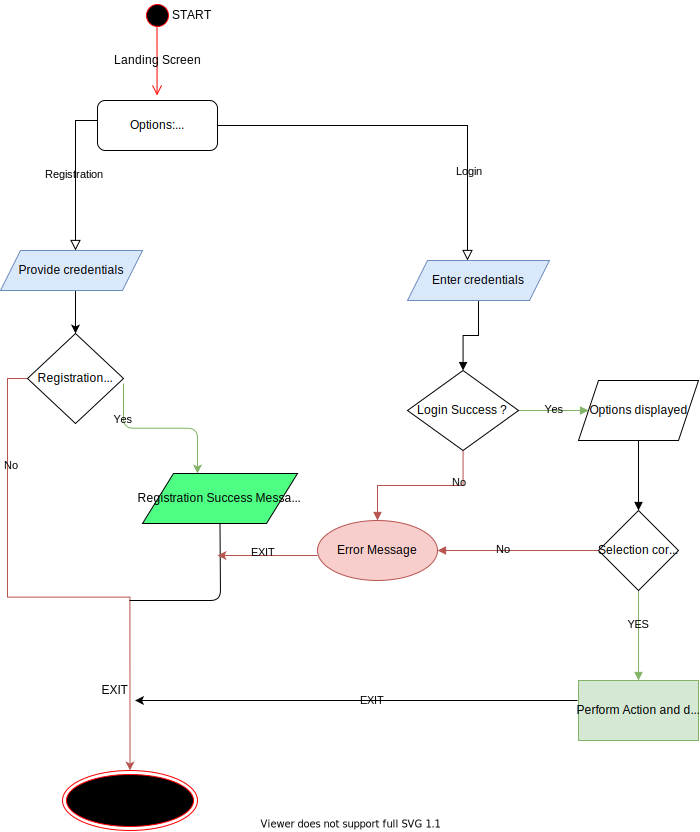

# LockedMe App
LockMe.com is an application to securely store your credentials. Once registered, you can 
store your credentials along with category/site details and retrieve them at any point in time.
From now on just remember one credential and leave rest on LockedMe.com.  

**_ flow diagram :_**

**User Stories :**
I am using agile(Scrum) to develop the application in 2 sprints (2 weeks).
_Sprint 1:_
**1)** As an architect, I want to design whole solution for LockMe.com so that flow and 
components are well-defined for development.
**2)** As a developer, I want develop registration page so that users can register on Lockme.com.

_Sprint 2:_
**1)** As a developer, I want to develop login page so that users can login using their credentials.
**2)** As a developer, I want to develop functionalities (retrieve, store and delete credentials).
**3)** As a tester, I want to test the functionalities built.

**github link :** 

**Future enhancements:**
This application can be furthered as a mobile application having deep security features for users to leverage 
and save credentials.